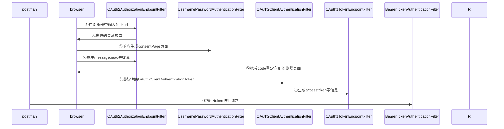

### 执行流程：

##### 1、在浏览器中输入如下url

​    http://127.0.0.1:8080/oauth2/authorize?client_id=messaging-client&response_type=code&scope=message.read&redirect_uri=https://www.baidu.com，由OAuth2AuthorizationEndpointFilter处理器进行处理并且经过DelegatingAuthenticationConverter进行将请求转化为Authentication(OAuth2AuthorizationCodeRequestAuthenticationToken),DelegatingAuthenticationConverter里面converters集合，默认 包括OAuth2AuthorizationCodeRequestAuthenticationConverter和OAuth2AuthorizationConsentAuthenticationConverter，我们也可以根据自己的需要进行添加AuthenticationConverter,遍历converters集合,如果转换成功直到转换成功就返回。
​    然后通过OAuth2AuthorizationCodeRequestAuthenticationProvider进行处理。最终进行身份验证的时候由于是匿名用户，所以会失败并跳转到登录页面。http://127.0.0.1:8080/login

##### 2、在登陆页面输入账号和密码 user1,password

​    http://127.0.0.1:8080/login进行登录，会通过AbstractAuthenticationProcessingFilter过滤器进行验证用户名和密码，验证通过后经过SavedRequestAwareAuthenticationSuccessHandler处理器进行处理，会通过session获取到之前的请求http://127.0.0.1:8080/oauth2/authorize?client_id=messaging-client&response_type=code&scope=message.read&redirect_uri=https://www.baidu.com,并通过DefaultRedirectStrategy重定向策略进行重定向到http://127.0.0.1:8080/oauth2/authorize?client_id=messaging-client&response_type=code&scope=message.read&redirect_uri=https://www.baidu.com

##### 3、重定向到http://127.0.0.1:8080/oauth2/authorize?client_id=messaging-client&response_type=code&scope=message.read&redirect_uri=https://www.baidu.com&continue

​    进行请求的时候，由于这次已经经过了身份认证，所以会通过,然后经过OAuth2AuthorizationEndpointFilter#sendAuthorizationConsent()方法进行处理,展示consentPage页面,当全选中message.read并提交的时候,会再次通过OAuth2AuthorizationEndpointFilter过滤器

##### 4、进行提交操作http://127.0.0.1:8080/oauth2/authorize,

​        通过OAuth2AuthorizationEndpointFilter过滤,此时通过OAuth2AuthorizationConsentAuthenticationConverter进行转换，转换为OAuth2AuthorizationConsentAuthenticationToken,这个里面包含了所需要的code,然后通过OAuth2AuthorizationEndpointFilter#sendAuthorizationResponse方法进行重定向，重定向后的会携带code在url后面

##### 5、使用postman进行换取token

​    post请求：http://127.0.0.1:8080/oauth2/token,
​    通过OAuth2ClientAuthenticationFilter过滤器，通过ClientSecretBasicAuthenticationConverter进行转换OAuth2ClientAuthenticationToken，OAuth2ClientAuthenticationToken存储的username和password已经解析成了明文然后并经过ClientSecretAuthenticationProvider验证后生成OAuth2ClientAuthenticationToken。然后通过OAuth2TokenEndpointFilter过滤器，由OAuth2AuthorizationCodeAuthenticationConverter将请求转换为OAuth2AuthorizationCodeAuthenticationToken，然后通过OAuth2AuthorizationCodeAuthenticationProvider进行身份验证，验证通过就进行生成OAuth2AccessTokenAuthenticationToken，里面包含accesstoken和refreshtoken，并返回给客户端
6、携带token进行请求
​        会通过BearerTokenAuthenticationFilter过滤器，然后进行JwtAuthenticationProvider验证，验证通过后再进行scope验证，就可以访问到资源了

