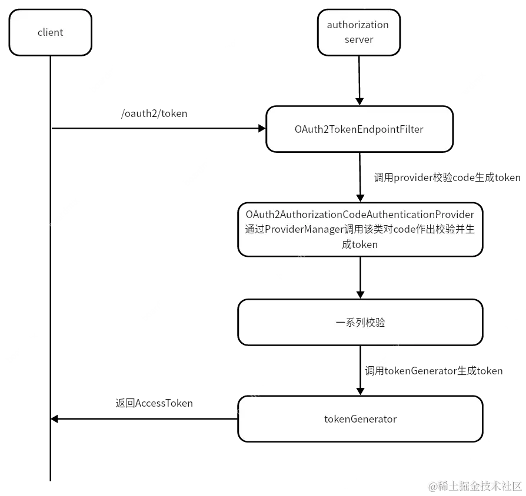
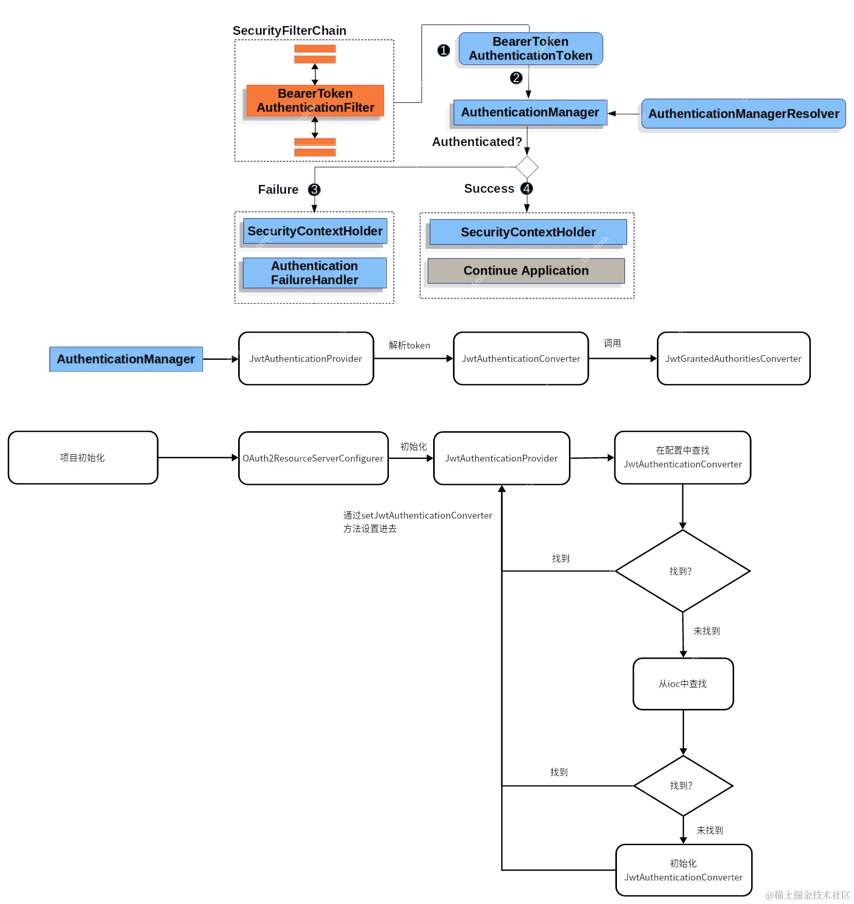
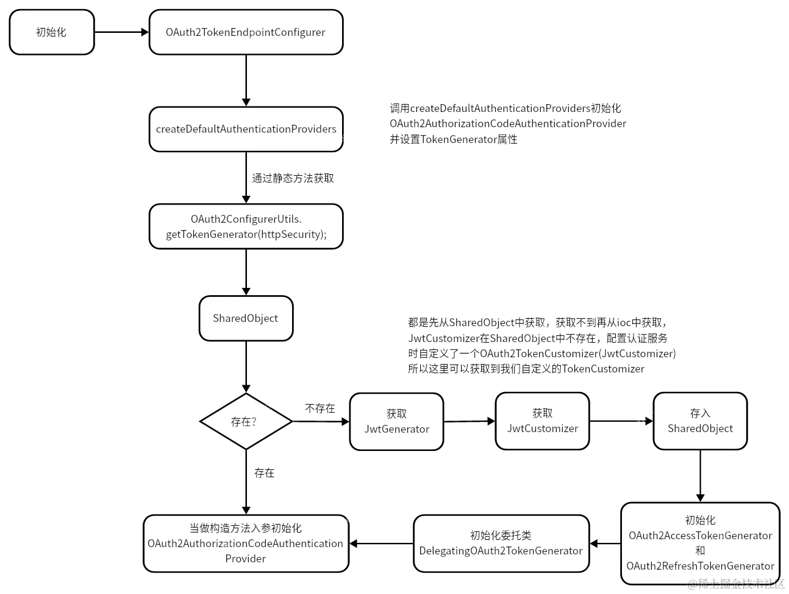

## AuthorizationConfig

```java
    /**
     * 配置jwk源，使用非对称加密，公开用于检索匹配指定选择器的JWK的方法
     *
     * @return JWKSource
     */
    @Bean
    public JWKSource<SecurityContext> jwkSource() {
        KeyPair keyPair = generateRsaKey();
        RSAPublicKey publicKey = (RSAPublicKey) keyPair.getPublic();
        RSAPrivateKey privateKey = (RSAPrivateKey) keyPair.getPrivate();
        RSAKey rsaKey = new RSAKey.Builder(publicKey)
                .privateKey(privateKey)
                .keyID(UUID.randomUUID().toString())
                .build();
        JWKSet jwkSet = new JWKSet(rsaKey);
        return new ImmutableJWKSet<>(jwkSet);
    }

    /**
     * 生成rsa密钥对，提供给jwk
     *
     * @return 密钥对
     */
    private static KeyPair generateRsaKey() {
        KeyPair keyPair;
        try {
            KeyPairGenerator keyPairGenerator = KeyPairGenerator.getInstance("RSA");
            keyPairGenerator.initialize(2048);
            keyPair = keyPairGenerator.generateKeyPair();
        } catch (Exception ex) {
            throw new IllegalStateException(ex);
        }
        return keyPair;
    }

    /**
     * 配置jwt解析器
     *
     * @param jwkSource jwk源
     * @return JwtDecoder
     */
    @Bean
    public JwtDecoder jwtDecoder(JWKSource<SecurityContext> jwkSource) {
        return OAuth2AuthorizationServerConfiguration.jwtDecoder(jwkSource);
    }

```

对于上面的这段代码的理解，在不编写这段代码的时候，默认会执行OAuth2AuthorizationServerJwtAutoConfiguration这个代码将其实例化。但是由于应用在每次启动的时候都会重新生成公钥和私钥，所以需要想办法让公钥和私钥能够固定下来。然后我们看一下token生成和解码，即编码器和解码器的生成注入过程。

## JwtDecoder

JwtDecoder注入到过滤器链中的过程如下

OAuth2ResourceServerConfigurer.init(H http) --> getAuthenticationProvider() -->getAuthenticationProvider() --> getJwtDecoder()

## JwtEncoder

OAuth2TokenEndpointConfigurer.init(HttpSecurity httpSecurity) --> createDefaultAuthenticationProviders(HttpSecurity httpSecurity) --> OAuth2ConfigurerUtils.getTokenGenerator(httpSecurity) --> OAuth2ConfigurerUtils.getJwtGenerator(HttpSecurity httpSecurity) --> OAuth2ConfigurerUtils.getJwtEncoder(HttpSecurity httpSecurity)


可以通过打断点，发现JwtEncoder和JwtDecoder两个对象在生成的时候用的JWKSource为同一个，所以可以通过这两个对象进行生成token和解密token。


流程图





